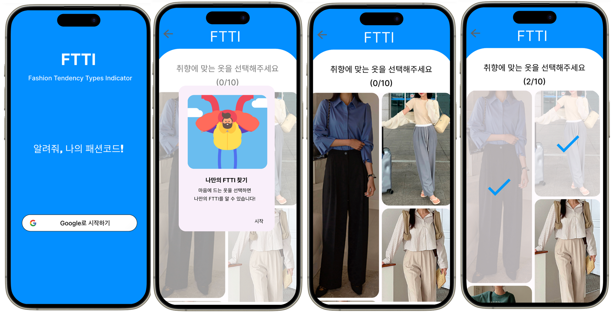
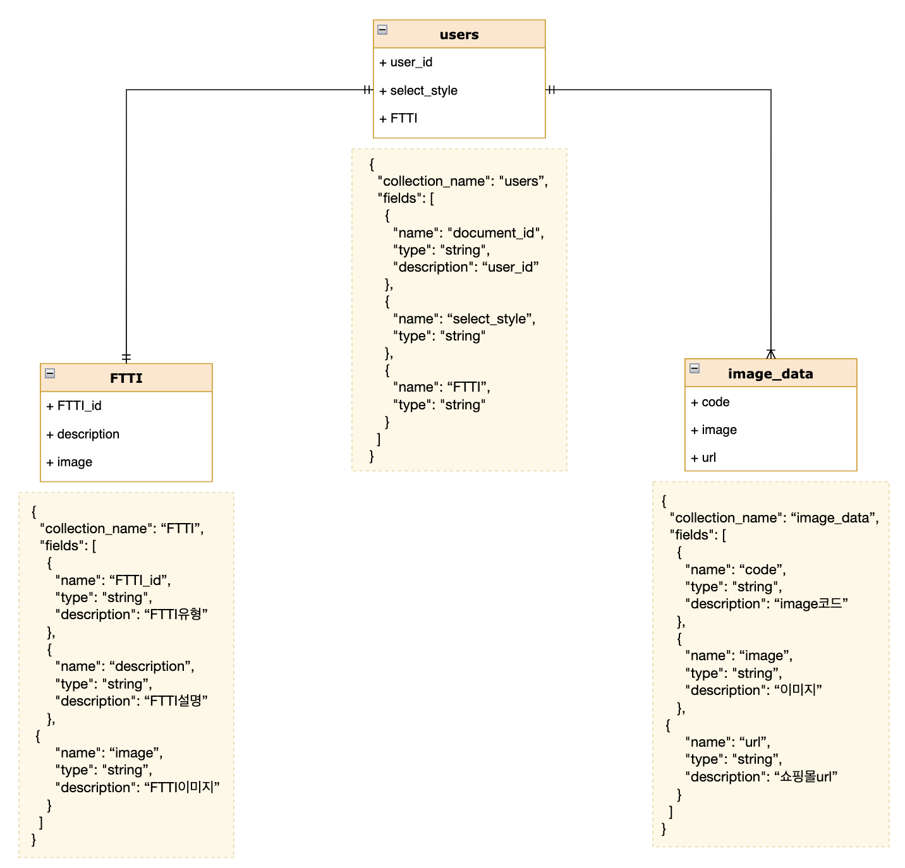
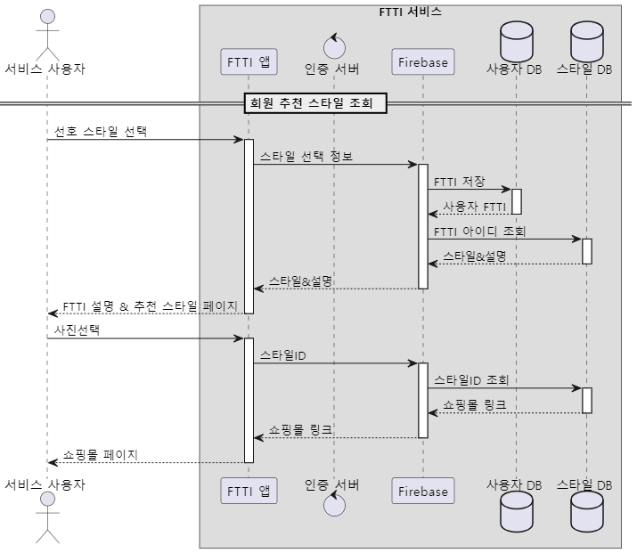

# 중간보고서

## **1. 프로젝트 수행팀 개요**

---

- 수행 학기 : 2024년 1학기
- 프로젝트명 : FTTI (Fashion-Tendency Types Indicator)
- 팀명 : 버스태워조 (01조)
- 자유 주제로 프로젝트 진행

| 구분 | 성명   | 학번       | 소속학과         | 연계전공       | 이메일            |
| ---- | ------ | ---------- | ---------------- | -------------- | ----------------- |
| 팀장 | 이보성 | 2017113439 | 글로벌무역학전공 | 융합SW연계전공 | dlqh406@gmail.com |
| 팀원 | 김민재 | 2018112519 | 산업시스템공학과 | 융합SW연계전공 | ax4628@gmail.com  |
| 팀원 | 장주리 | 2022113109 | 융합보안학과     | 융합SW연계전공 | jjr84@dgu.ac.kr   |

- 지도교수: 대학혁신지원사업단 이길섭 교수
- 공동교수: SW교육원 박효순 교수

## **2. 프로젝트 수행계획**

---

### **2.1 프로젝트 개요**

- 사용자의 패션 취향 유형(Fashion-Tendency Types Indicator)을 정의하여 이에 따라 취향에 맞는 옷을 추천하여 자신에게 맞는 옷을 찾을 수 있도록 돕습니다.
- ML을 사용하여 옷 스타일의 유형을 분류하는 모델을 구축합니다.
- 사용자가 쉽게 자신의 패션 트렌드 유형을 확인하고 추천을 받을 수 있는 앱 인터페이스를 개발합니다.
- 사용자에게 선택된 옷들을 분석하여 사용자의 FTTI를 파악합니다.
- 개인화된 추천을 통해 사용자의 만족도를 높일 수 있습니다.
- 나의 패션 취향을 이해하고 내 취향에 맞는 옷 스타일을 추천 받고 싶어 하는 사용자를 위해 기획 되었습니다.

### **2.2 추진 배경(자료 조사 및 요구 분석)**

(1) 개발 배경 및 필요성

- **패션 트렌드의 지속적인 변화 :** 패션 산업은 빠르게 변화하고 있습니다. 새로운 디자인, 스타일 및 트렌드가 지속적으로 등장하며, 이로 인해 사용자들은 자신의 스타일을 새로운 트렌드에 맞추기 위해 노력합니다.
- **개인화된 패션 경험 수요 증가 :** 사용자들은 자신에게 가장 적합한 스타일과 제품을 찾고 싶어 합니다. 일반적인 패션 추천보다는 자신의 취향과 스타일에 맞는 맞춤형 추천이 더욱 중요시되고 있습니다.
- **데이터 기술과 머신 러닝의 발전 :** 데이터 기술과 머신 러닝 알고리즘의 발전으로 사용자의 패션 관심사와 취향을 파악하고 분석하는 것이 가능해졌습니다. 이를 활용하여 개인화된 패션 추천 시스템을 구축할 수 있습니다.

(2) 선행 기술 및 사례 분석

- **기술 요구 사항 :** 데이터 수집 및 이미지 분류 기술 등이 필요합니다. 그리고 이미지를 분석하기 위해 머신 러닝 알고리즘에 대한 이해와 활용 능력이 필요합니다.
- 선행 사례
  - **Amazon Personal Shopper :** 아마존의 Personal Shopper 서비스는 사용자의 취향과 스타일에 따라 의류를 추천합니다. 사용자는 트렌드 설문조사를 작성하고 전문 스타일리스트가 해당 정보를 기반으로 상품을 추천합니다.
  - **Pinterest Lens** : Pinterest Lens는 사용자가 사진을 찍어 온라인에서 관련 상품을 찾을 수 있는 기능을 제공합니다. 사용자가 특정 패션 아이템에 관심을 가질 경우, 이를 기반으로 유사한 상품을 추천합니다.
- FTTI 만의 차별성
  - 13가지의 세분화된 스타일 분류코드가 사용자의 패션 취향을 보다 촘촘히 분류하며 스타일링의 도움을 줄 수 있는 정보를 제공하는것이 차별 강점입니다.
  - 나아가 사용자의 스타일 분류코드에 맞게 옷을 추천하는 큐레이션 기능은 옷쇼핑을 하는데 큰 도움을 제공합니다. 또한 자동으로 사용자 선호 스타일을 수집하고 지속적으로 스타일 코드를 업데이트하여 변화하는 사용자의 취향에 맞게 추천할 수 있습니다.
- FTTI와 선행 사례 비교 표

- FTTI의 한계점과 개선 방법
  - **한계점**
    - **데이터 품질 및 다양성:** 다양한 사용자의 취향을 반영하기 위해서는 풍부하고 다양한 데이터가 필요합니다. 지금 개발 수준에서는 3가지 스타일 코드로 모든 스타일을 분류합니다. 빠르게 변화하는 패션 트렌드와 소비자 취향 변화에 빠른 대응이 어려울 수 있습니다.
    - **사용 편의성** : 타 사례에 비해 현재 구현 예정인 소셜 로그인의 종류가 적고, 앱에서 스타일 이미지 로딩 속도가 느려 사용자의 만족감이 떨어질 수 있습니다.
  - **개선방법**
    - 웹 스크래핑 기술을 접목 시켜 웹상에서 대량으로 빠르게 다양한 패션 이미지를 수집 할 수 있어 스타일의 다양성과 품질이 대폭 상승할 것입니다.
    - 현 프로젝트에 주어진 시간과 비용에 한계가 있기 때문에 사용 편의성을 위한 기능을 확장하지 못하고 있습니다. 프로젝트 종료 이후, 소셜로그인 기능 확장, 성능 개선, 쇼핑몰과 직접 협업하여 FTTI 앱을 확장시킬 것입니다.

### **2.3 개발 내용**

#### **(1) 개발 목표**

- 사용자가 자신의 패션을 이해하고, 이에 맞는 스타일을 추천받아 효율적으로 스타일링을 할 수 있습니다.
- **세분화된 스타일 분류코드**를 통해 사용자에게 맞는 옷스타일링 팁과 큐레이션 기능을 제공하는 서비스 개발합니다.
- 수집한 이미지와 해당 이미지의 스타일 코드를 정의한 데이터를 서버에 저장하는 웹 인터페이스를 개발하고 **사용자가 자신의 패션 성향 유형을 확인하고 추천을 받을 수 있는 앱 인터페이스를 개발합니다.**

#### **(2) 개발 내용 :**

- 개발 범위(요구사항 명세표)

- 현 프로젝트에서는 사용자를 대상으로 개발을 진행할 예정입니다.
- 기능

  - 소셜 로그인 기능 : 구글 소셜 로그인 기능을 구현합니다.
  - 패션 스타일 선택 기능 : 사용자가 자신의 취향에 맞는 스타일 10개를 선택합니다.
  - FTTI(스타일 유형)분석 기능 : 선택한 스타일의 비율을 바탕으로 FTTI를 분석합니다.
  - FTTI 설명: 사용자별 FTTI 유형에 대해 상세히 설명합니다.
  - 스타일 추천 기능 : 사용자의 FTTI 유형별 선호하는 스타일을 그리드 형태로 추천합니다.
  - 쇼핑몰 링크 연결 기능 : 추천 스타일을 클릭하면 해당 쇼핑몰 사이트로 연결됩니다.
- 특징

  - 스타일 추천에 사용할 이미지는 머신러닝을 통해 O(Office), C(Casual), F(Feminine) 총 3가지로 라벨링합니다.
  - 라벨링한 이미지 데이터를 사용자가 자신의 취향에 맞는 스타일을 선택하면 이를 토대로 FTTI 유형을 분석합니다.
  - 스타일 추천은 각 사용자가 앱 초기에 선택했던 O, C, F의 비율을 바탕으로 추천합니다.
- 최종 설계 결과물

- 앱 UI

- 데이터 모델

  
- 최종 설계 결과물의 시스템 구성

- 시스템 구성

- 유스케이스 다이어그램

- 현 프로젝트에서는 사용자 기능만 구현할 예정입니다.
- 사용자

  - 로그인을 합니다.
  - 자신의 취향에 맞는 스타일 10개를 선택합니다.
  - 선택한 스타일을 바탕으로 FTTI 코드를 조회합니다.
  - FTTI 유형에 따른 스타일을 조회합니다.
  - 추천 스타일을 선택하면 해당 쇼핑몰 링크로 연동되어 스타일을 구매할 수 있습니다.
- 쇼핑몰 운영자

  - 로그인을 합니다,
  - 사용자에게 보여줄 상품을 등록, 수정, 삭제하여 상품을 직접 관리합니다.
  - 일 사용자 수, 상품별 판매현황 등 사용자 통계를 조회합니다.
- ‘추천 스타일 조회 및 쇼핑몰 링크 연결’ 시퀀스 다이어그램

  

  1. 사용자가 선호 스타일을 선택합니다.
  2. 선택한 스타일 정보를 바탕으로 FTTI 유형을 정의하고, 해당 FTTI 정보를 사용자 DB에 저장합니다.
  3. 스타일 DB에서 사용자 DB에 저장된 FTTI 아이디를 조회하고, 이에 해당하는 스타일 사진과 FTTI의 설명에 대한 정보를 Firebase로 전달합니다.
  4. 사용자는 앱을 통해  FTTI의 설명과 스타일을 추천 받습니다.
  5. 추천 받은 스타일 페이지에서 스타일 사진을 선택합니다.
  6. 해당 스타일의 ID를 사용자 스타일DB에 전달합니다.
  7. 스타일 DB에서 해당 스타일의 쇼핑몰 링크를 앱으로 전달합니다.
  8. 사용자는 자신이 선택한 사진의 쇼핑몰 페이지에 접속합니다.

**(3) 대안 도출 및 구현 계획**

- SW 개발 선정(웹 개발 vs 앱 개발)

  - 사용자 입장에서 패션 스타일을 분석하고, 추천해주는 서비스를 생각했을 때, 웹보다 앱이 더 편리성이 있다고 생각했고, 개발자 관점에서 웹보다 앱 개발에 대한 경험이 많았기 때문에 앱을 통해 서비스를 제공하기로 했습니다.
- DB 선정 (Spring Boot vs Firebase)

  - 유연성 및 확장성, 보안성 측면에서 Spring Boot가 더 높은 수준을 제공하지만,  Firebase는 서버리스 백엔드 플렛폼이기 때문에 사용이 보다 쉽고, 다수의 팀원이 Firebase 사용 경험이 있어 주어진 시간내에 프로젝트를 진행하기엔 Firebase가 적절하다 생각했습니다.
- ML 구현 방법 선정 (Google Vision API vs OpenCV&Tensorflow)

  - 편의성 및 정확성 측면에서는 사전학습이 되어있는 Google Vision API를 활용하는 것이 더 좋지만, 일정 용량 이상의 데이터를 처리하기 위해서는 돈을 내야하기에 무료로 제공되는 OpenCV와 Tensorflow를 활용하였습니다.
- 구현 계획

  - 구글 소셜 로그인 구현

    - 구글 소셜 로그인 API를 활용하여 사용자가 간편하게 로그인할 수 있는 기능을 구현할 계획입니다.
  - 스타일 선택 페이지 구현

    - 사용자가 자신의 패션 취향을 고를 수 있는 스타일 선택 페이지입니다. 스타일은 그리드 형태로 구현할 예정이며, 해당 페이지에서 선택한 데이터를 바탕으로 패션 취향 유형인 FTTI 분석과 스타일 추천에 활용할 계획입니다.
  - 스타일 설명 페이지 구현

    - 선택한 스타일을 바탕으로 분석한 FTTI에 대한 상세 설명 조회가 가능한 페이지입니다. FTTI별 대표 이미지를 선정하여 화면에 띄움으로써 사용자의 이해를 더 높이려고 합니다.
  - 스타일 추천 페이지 구현

    - 사용자의 FTTI 유형과 스타일 선택 비율을 바탕으로 스타일을 추천하는 페이지 입니다. 해당 페이지도 그리드로 패션 스타일을 화면에 띄울 것입니다. 사용자는 자신의 취향에 맞는 스타일을 파악할 수 있습니다.
  - 쇼핑몰 링크 연결 페이지 구현

    - 사용자가 추천 받은 스타일에서 이미지를 선택하면 해당 스타일 판매 쇼핑몰로 연결되는 기능입니다. 사용자는 자신의 스타일에 맞는 옷을 구매할 수 있습니다. 추후 쇼핑몰과 협업하여 해당 쇼핑몰로 연결되게 확장할 계획입니다.
  - ML을 이용한 이미지 자동 라벨링 구현

    - 데이터를 Cloud Storage로부터 받아와서, 사전 학습된 ML Model을 통해 이미지에 대한 label을 부여하고, FireStore에 이미지에 대한 정보(label, cloud storage상의 위치)를 json형태로 저장합니다.
  - 전체 알고리즘 플로 차트

    

**(4) 설계의 현실적 제한 요소**

- **데이터 자원의 한계** : 스타일을 분류하는 스타일 이미지 데이터 자원에는 제한이 있을 수 있습니다. 일일이 인터넷 쇼핑몰을 접속하여 이미지를 캡쳐하여 데이터를 수집해야하는 번거로움이 있습니다.
- **사용자 다양성 및 일반화 문제:** 사용자들의 패션 관심사와 취향은 매우 다양할 수 있습니다. 따라서 현재 단계의 FTTI 에서 모든 사용자의 패션 취향을 모두 대변할 수 없습니다. 일부 사용자들에게는 적합한 추천을 제공하기 어려울 수 있습니다.
- **현실적인 비용 문제** : 앱을 등록하기 위해서는 개발자 계정을 생성해야하는데, 그 과정에서 연간 비용이 발생합니다. 현실적으로 비용을 지불하는 것에 부담이 있기때문에 앱스토어 및 플레이스토어에 등록하는데 어려움이 있습니다.

**(5) 개발 환경**

- HW 장비
  - 삼성 노트북
  - 맥북
- SW
  - Back-End
    - Server : Firebase
    - DB : FireStore, Google Cloud Storage
  - Front-End
    - Language : Dart, JavaScript, HTML, CSS
    - Framework : Flutter
  - ML
    - Language: Python
    - Libraries: OpenCV, Tensorflow
  - IDE : Visual Studio Code, Android Studio
  - Tool : Slack, GitHub, Notion

## 2.4 개발 효과

- **개인화된 패션 추천 :** 사용자의 패션 관심사와 취향을 고려하여 개인화된 패션 추천을 제공함으로써, 사용자들이 자신에게 맞는 스타일을 더욱 쉽게 발견할 수 있습니다.
- **패션 트렌드 이해 증진 :** 앱을 통해 사용자들은 자신의 패션 트렌드 유형을 더 잘 이해하고 인식할 수 있습니다. 이는 사용자들이 더 나은 패션 선택을 할 수 있도록 돕고, 새로운 트렌드를 발견하는 데 도움이 됩니다.
- **고객 만족도 향상 :** 개인화된 추천 시스템을 통해 사용자들은 자신의 취향에 맞는 제품을 더 쉽게 찾을 수 있습니다. 이는 사용자들의 만족도를 높이고 앱을 계속 이용하도록 유도할 수 있습니다.

## 2.5 추진 일정

- 세부 작업에 대한 간트차트 및 구성원 역할

## 2.6  팀원 역할

| 구분 | 성명   | 팀내 역할               |
| ---- | ------ | ----------------------- |
| 팀장 | 이보성 | BE, 앱 UI 디자인        |
| 팀원 | 김민재 | ML, Github, Notion 관리 |
| 팀원 | 장주리 | FE, 회의록 작성         |

## 2.7 참고문헌

- stackoverflow Q&A 다수
- Velog
  - [다이어그램 참고](https://velog.io/@wansook0316/Sequence-Diagram)
  - [OpenCV 활용 사례](https://velog.io/@jaehyeong/OpenCV%EB%A5%BC-%ED%99%9C%EC%9A%A9%ED%95%9C-%EA%B8%B0%EC%B4%88-%EC%9D%B4%EB%AF%B8%EC%A7%80-%EC%B2%98%EB%A6%AC-with-Python)
- Firebase 공식 문서
  - [구글 소셜 로그인 인증](https://firebase.google.com/docs/auth/flutter/start?hl=ko)
  - [FireStore(DB) 활용 방법](https://firebase.google.com/docs/firestore?hl=ko)
- ChatGPT

## 2.8 성과 창출 계획

| 항목        | 세부내용                  | 예상(달성)시기 |
| ----------- | ------------------------- | -------------- |
| Github 등록 | 동국대 CSID에 업로드 예정 | 24년 5월 29일  |

[👉***README로 돌아가기***](https://github.com/CSID-DGU/2024-1-OSSProj-ComfyRide-01)
