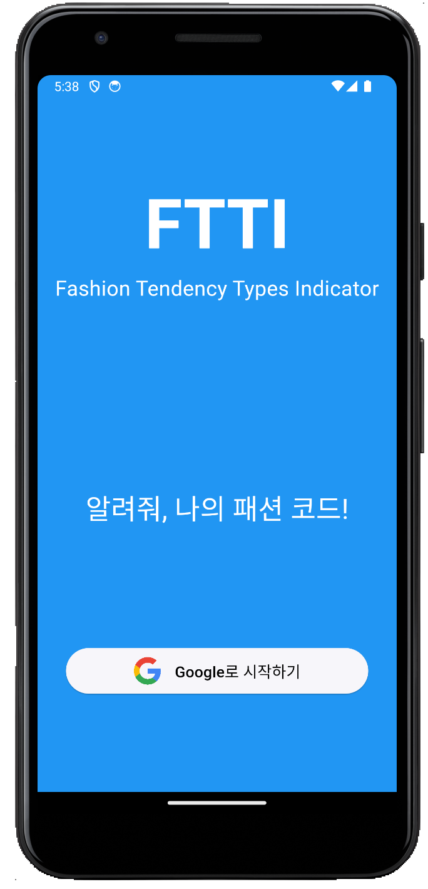
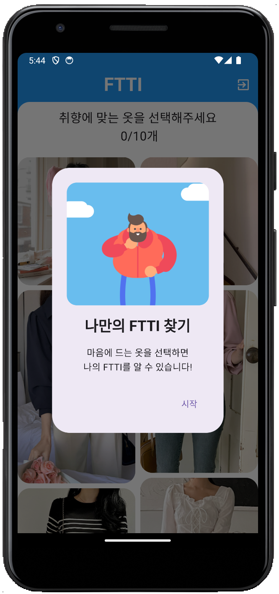
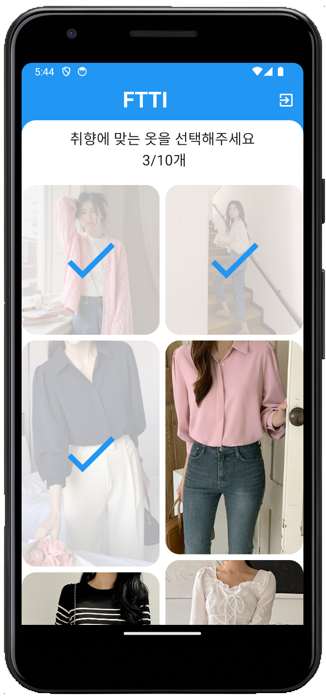
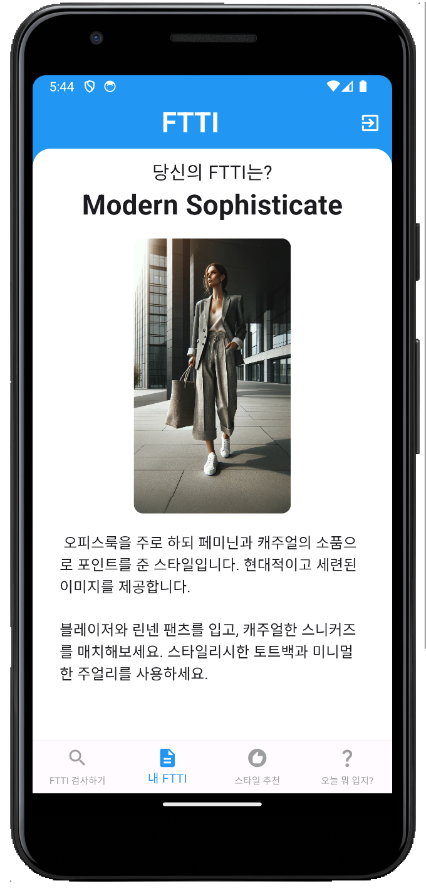
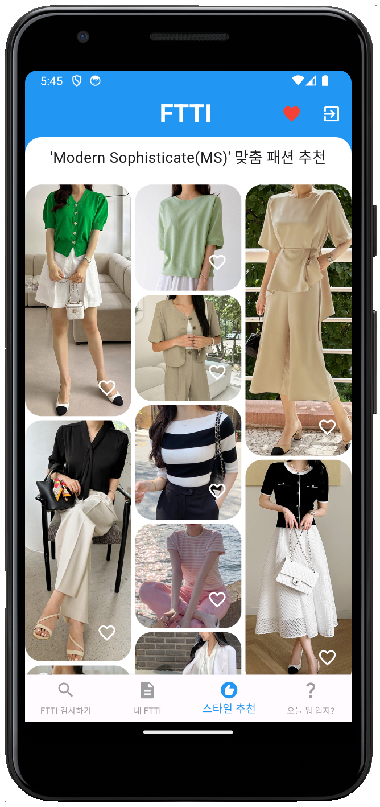
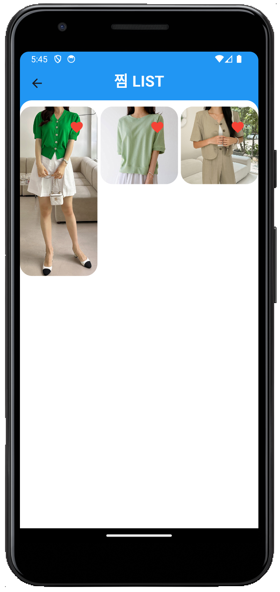
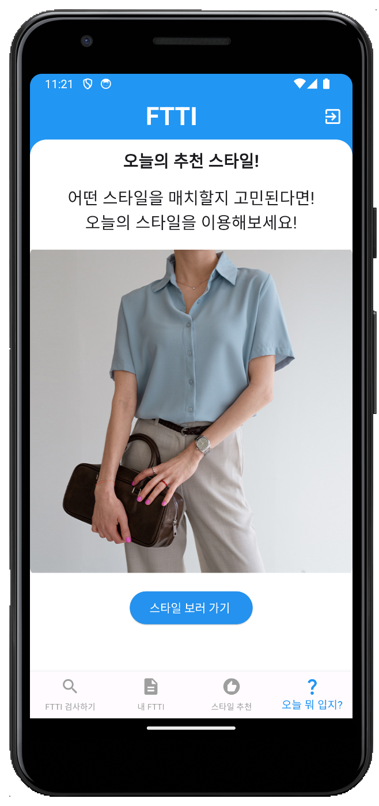
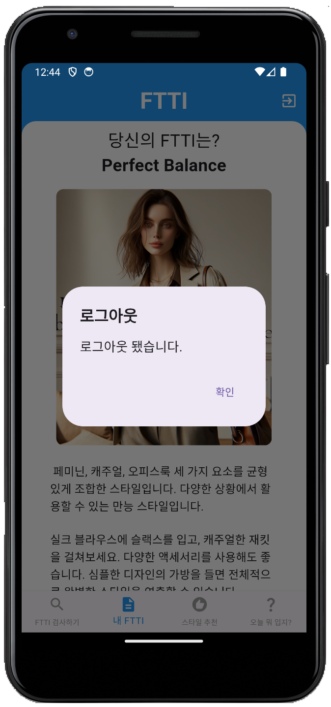

# A3.1 OSS 프로젝트 최종보고서

## I. 프로젝트 수행팀 개요

- 수행 학기:  2024년 1학기
- 프로젝트명:  FTTI (Fashion-Tendency Types Indicator)
- Key Words :  패션, 스타일, 추천, 앱, 쇼핑
- 팀명: 버스태워조(ComfyRide)

| 구분 | 성명   | 학번       | 소속학과         | 연계전공       | 이메일            |
| ---- | ------ | ---------- | ---------------- | -------------- | ----------------- |
| 팀장 | 이보성 | 2017113439 | 글로벌무역학전공 | 융합SW연계전공 | dlqh406@gmail.com |
| 팀원 | 김민재 | 2018112519 | 산업시스템공학과 | 융합SW연계전공 | ax4628@gmail.com  |
| 팀원 | 장주리 | 2022113109 | 융합보안학과     | 융합SW연계전공 | jjr84@dgu.ac.kr   |

- 지도교수: 대학혁신지원사업단 이길섭 교수
- 공동교수: SW교육원 박효순 교수

## II. 프로젝트  수행 결과

### 1. 프로젝트 개요  

- 사용자의 패션 취향 유형(Fashion-Tendency Types Indicator)을 정의하여 이에 따라 취향에 맞는 옷을 추천하여 자신에게 맞는 옷을 찾을 수 있도록 돕는다.
- ML을 사용하여 옷 스타일의 유형을 분류하는 모델을 구축한다.
- 사용자가 쉽게 자신의 패션 트렌드 유형을 확인하고 추천을 받을 수 있는 앱 인터페이스를 개발한다.
- 사용자가 선택한 스타일을 분석하여 사용자에게 FTTI를 부여한다.
- 개인화된 추천을 통해 사용자의 만족도를 높일 수 있다.

#### 1.1 개발 동기 및 목적  

패션은 개성을 표현하는 중요한 수단이며, 많은 사람들이 자신만의 스타일을 찾는 것을 중요하게 생각한다. 하지만 빠르게 변화하는 패션 트렌드와 다양한 스타일 선택지는 사용자들에게 혼란을 줄 수 있다. 이러한 문제를 해결하고자, 우리는 개인의 패션 취향을 파악하고 맞춤형 스타일을 추천해주는 시스템을 개발하고자 한다.

FTTI(Fashion-Tendency Types Indicator) 프로젝트는 머신러닝을 활용하여 사용자의 패션 취향을 분석하고, 이를 바탕으로 맞춤형 스타일을 추천하는 시스템을 구축하고자 한다. 이를 통해 사용자들이 자신의 패션 스타일을 더 잘 이해하고, 효율적으로 스타일을 선택할 수 있도록 돕는다.

이 프로젝트의 주요 목적은 다음과 같다:

1. **사용자의 패션 취향 파악:** 사용자들이 자신의 패션 취향을 명확히 이해할 수 있도록 돕는다.
2. **맞춤형 스타일 추천:** 사용자에게 개인화된 스타일을 추천하여 만족도를 높인다.
3. **시간과 노력 절약:** 적절한 스타일을 찾는 데 소비되는 시간과 노력을 줄인다.
4. **패션 트렌드 접근성 향상:** 사용자는 변화하는 패션 트렌드에 쉽게 접근하고 이에 관한 스타일을 추천받을 수 있다.

#### 1.2 필요성

- **패션 트렌드의 지속적인 변화 :** 패션 산업은 지속적으로 변화하며, 새로운 디자인과 스타일이 계속해서 등장한다. 이러한 변화 속에서 사용자들이 최신 트렌드를 따라가고, 자신에게 맞는 스타일을 찾는 데 어려움을 겪고 있다.
- **개인화된 패션 경험 수요 증가 :** 사용자는 자신만의 개성과 취향을 반영한 스타일을 선호합니다. 일반적인 패션 추천보다 개인의 취향과 스타일에 맞춘 맞춤형 추천이 중요해지고 있다.
- **데이터 기술과 머신 러닝의 발전 :** 데이터 기술과 머신 러닝 알고리즘의 발전으로 사용자의 패션 관심사와 취향을 분석하고 파악하는 것이 가능해졌다. 이를 통해 개인화된 패션 추천 시스템을 구축할 수 있다.

#### 1.3 개발 목표  

- 사용자가 자신의 패션을 이해하고, 이에 맞는 스타일을 추천받아 효율적으로 스타일링을 할 수 있도록 돕는다.
- **머신러닝 모델**을 활용해 이미지 데이터를 자동을 labeling해 스타일 DB에 저장되도록 하는 workflow를 개발한다.
- **세분화된 스타일 분류코드**를 통해 사용자에게 맞는 옷스타일링 팁과 큐레이션 기능을 제공하는 서비스를 개발한다.
- 수집한 이미지와 해당 이미지의 스타일 코드를 정의한 데이터를 서버에 저장하는 웹 인터페이스를 개발하고 **사용자가 자신의 패션 성향 유형을 확인하고 추천을 받을 수 있는 앱 인터페이스를 개발한다.**

### 2. 최종결과물 소개  

#### 1. 로그인 화면  

  

- 'Google로 시작하기' 버튼을 눌러 회원가입 및 로그인을 진행한다.
  
#### 2. 스타일 선택 화면  

 

- '시작' 버튼을 눌러 FTTI 유형 검사를 시작한다.
- 선호하는 스타일 10가지를 선택한다.  

#### 3. FTTI 조회 화면  

- 자신의 FTTI에 대한 설명을 조회한다.
- 하단의 '스타일 추천' 메뉴를 통해 자신의 FTTI에 맞는 스타일을 추천받을 수 있다.
- 좌측 하단의 'FTTI 검사하기' 메뉴를 통해 FTTI를 다시 검사하여 부여받을 수 있다.

#### 4. 스타일추천 화면  

- 자신의 FTTI 코드와 선택한 취향의 비율을 반영한 스타일을 추천 받을 수 있다.

#### 4.1. 찜&찜목록 화면

 

- 이미지 오른쪽 하단의 하트 버튼을 누르면 찜 목록에 추가할 수 있다.
- 앱 상단의 하트 버튼을 누르면 찜 목록 페이지로 이동할 수 있다.
- 찜목록에서 이미지 오른쪽 상단의 하트를 선택하면 찜 제거를 할 수 있다.  

#### 5. 랜덤 스타일 추천 화면  

- 랜덤 스타일 추천 화면으로, 해당 화면 접속마다 스타일이 랜덤하게 바뀐다.

#### 6. 아이템 구매 화면

- "4. 스타일 추천 화면", "4.1. 찜목록 화면" 에서 스타일 사진을 선택하면 해당 스타일의 쇼핑몰 사이트로 연결된다.
- "5. 랜덤 스타일 추천 화면" 에서 '스타일 보러 가기' 버튼 선택하면 해당 스타일을 구매할 수 있는 쇼핑몰 사이트로 연결된다.  

#### 7. 로그아웃 팝업창

- "1. 로그인 화면"을 제외한 모든 화면 우측 상단의 아이콘을 선택하면 로그아웃 팝업 창이 뜬다.
- 확인 버튼을 누르면 로그아웃이 되고, 로그인 페이지로 이동한다. 
  
### 3. 프로젝트 추진 내용

#### 3.1 프로젝트 진행과정

##### 프로젝트 추진 일정 - 간트차트

  

- 각 기능(item)별로 작업자를 할당해 프로젝트를 진행하였다.

##### 요구사항 명세서

  
  
- 구현 사항
  - 로그인 기능
    - Google 소셜 로그인 기능 구현
  - 스타일 선택
    - 사용자가 자신의 취향에 맞는 스타일 선택 페이지 구현
  - FTTI 조회
    - 사용자 FTTI에 대한 설명 조회 페이지 구현
  - FTTI별 스타일 추천
    - 사용자 FTTI에 맞는 추천 스타일 조회 페이지 구현
- 추가 구현 사항
  - 중간 발표 이후 기능 추가가 필요하다 판단되어 아래 항목들을 추가 구현함
  - 찜 & 찜 목록 조회  
    - 스타일 추천 페이지에서 찜하고 싶은 스타일 선택하여 찜 생성
    - 찜 조회 화면에서 찜 목록 확인 및 삭제 가능
    - 찜한 스타일 선택시 해당 아이템 구매 페이지로 이동 가능
  - 랜덤 스타일 추천
    - 사용자 FTTI 맞춤 스타일 추천이 아닌, 랜덤 스타일 추천 기능으로, 해당 페이지 접속시마다 랜덤으로 스타일 추천해주는 페이지
    - '스타일 보러가기' 버튼 클릭시 해당 아이템 구매 페이지로 이동 가능
- 추후 구현
  - 해당 사항은 추후 기능 서비스 확장 차원에서 구상해놓은 것으로, 금번 프로젝트 종료 이후 구현할 계획임
  - 쇼핑몰과 협업시, 해당 쇼핑몰 관리자가 직접 스타일을 등록, 수정, 관리 기능
  - 앱 사용자 통계 조회 기능

##### 유스케이스 다이어그램

- 요구사항 명세서를 바탕으로, 사용자가 FTTI 앱을 통해 상호작용할 수 있는 Use Case를 나타내었다.
- "스타일 찜", "찜목록 조회", "랜덤 스타일 조회" 는 중간발표 이후 추가된 기능이다.
- 쇼핑몰 운영자가 앱과 상호작용 하는 부분은 추후 구현 과제로 남겨두었다.

##### 시스템 구성도

이 시스템 구성도는 FTTI 프로젝트의 전체 아키텍처를 나타낸다. 시스템은 크게 Mobile Client와 Google Cloud Platform으로 구성된다.

###### 1. Mobile Client

- **로그인 및 회원가입:** 사용자는 모바일 클라이언트를 통해 Google 소셜 로그인 기능을 사용하여 쉽게 회원가입 및 로그인을 할 수 있다.
- **FTTI 및 추천 스타일 조회:** 사용자는 자신의 패션 성향 유형을 확인하고, 이에 맞는 스타일 추천을 받을 수 있다.
- **선호 스타일 저장 및 저장된 스타일 조회:** 사용자는 선호하는 스타일을 선택하여 저장하고, 저장된 스타일을 조회할 수 있다.
- **패션 아이템 구매:** 사용자가 추천받은 스타일을 선택하여 직접 구매할 수 있는 기능을 제공한다.

###### 2. FTTI

- 모바일 클라이언트와 Google Cloud Platform 간의 중개 역할을 하며, 사용자의 요청을 받아 서버와 통신한다.

###### 3. Google Cloud Platform

- **Cloud Storage:** 이미지 데이터를 저장하는 데 사용된다. 이미지 등록 페이지를 통해 업로드한 이미지 데이터는 이곳에 안전하게 저장된다.
- **Firestore:** 사용자 데이터와 이미지 데이터의 메타데이터를 저장한다. 사용자의 패션 성향 유형 및 선호 스타일 등의 데이터를 관리한다.
- **Firebase Authentication:** 사용자의 인증 및 권한 관리를 담당한다. 사용자는 Firebase를 통해 안전하게 로그인하고 자신의 데이터를 관리할 수 있다.

##### Flow Chart

이 Flow Chart는 사용자가 앱을 사용할 때의 주요 흐름을 나타낸다.

1. **앱 접속:** 사용자가 앱에 접속한다.
2. **로그인:** 사용자는 Google 소셜 로그인 기능을 통해 로그인한다.
3. **최초 접속 여부 확인:** 사용자가 앱에 처음 접속하는지 여부를 확인한다.
   - **최초 접속인 경우:** 사용자는 패션 취향을 선택한다. 선택한 데이터를 기반으로 FTTI가 생성되고, DB에 저장된다.
   - **최초 접속이 아닌 경우:** 기존에 저장된 FTTI 데이터를 조회한다.
4. **FTTI 조회:** 사용자는 자신의 FTTI를 조회한다.
5. **스타일 추천 및 선택:** FTTI에 따라 스타일이 추천된다.
   - 사용자는 추천된 스타일을 찜하거나, 찜 목록을 조회할 수 있다.
     - 찜 목록에서 스타일을 선택하여 쇼핑몰 링크로 이동할 수 있다.
   - 선택한 스타일을 쇼핑몰 링크로 이동하여 구매할 수 있다.
6. **랜덤 스타일 추천:** 사용자는 랜덤 스타일 추천 기능을 통해 다양한 스타일을 탐색할 수 있다.
   - 랜덤으로 추천된 스타일을 선택하여 쇼핑몰 링크로 이동할 수 있다.

##### 시퀀스 다이어그램

**1. FTTI 검사, 조회, 추천 스타일 조회**
{: width="70%" height="70%"}

**다이어그램 설명:**
이 시퀀스 다이어그램은 FTTI 검사, FTTI 조회, 추천 스타일 조회에 대한 프로세스 흐름을 보여준다. 주요 구성 요소로는 서비스 사용자, FTTI 앱, Firebase, 그리고 다양한 데이터베이스(사용자 DB, 스타일 DB, FTTI DB)가 포함된다.

- **FTTI 검사:**
  - 사용자가 선호 스타일을 선택한다.
  - 선택한 스타일 정보가 FTTI 서비스로 전송된다.
  - FTTI 서비스는 이 정보를 데이터베이스에 저장한다.

- **FTTI 조회:**
  - 사용자가 "내 FTTI" 버튼을 클릭한다.
  - FTTI 서비스는 사용자 ID와 해당 FTTI 정보를 데이터베이스에서 조회한다.
  - 조회된 FTTI 설명이 사용자에게 전송되어 FTTI 설명 페이지에 표시된다.

- **추천 스타일 조회:**
  - 사용자가 "스타일 추천" 버튼을 클릭한다.
  - FTTI 서비스는 다시 사용자 ID와 해당 FTTI 정보를 조회한다.
  - FTTI 정보를 기반으로 추천 스타일 ID를 데이터베이스에서 가져온다.
  - 추천 스타일 ID를 사용하여 추천 스타일을 사용자에게 표시한다.

**2. 스타일 찜, 찜목록 조회, 랜덤 스타일 조회**
{: width="70%" height="70%"}

**다이어그램 설명:**
이 시퀀스 다이어그램은 스타일 찜, 찜목록 조회, 랜덤 스타일 조회에 대한 워크플로우를 보여준다. 주요 구성 요소로는 서비스 사용자, FTTI 앱, Firebase, 그리고 데이터베이스(사용자 DB, 스타일 DB)가 포함된다.

- **스타일 찜:**
  - 사용자가 스타일을 찜하기 위해 클릭한다.
  - FTTI 앱이 사용자 ID와 스타일 ID를 FTTI 서비스로 전송한다.
  - FTTI 서비스는 스타일 ID를 데이터베이스에 저장한다.

- **찜목록 조회:**
  - 사용자가 찜목록을 조회하기 위해 요청한다.
  - FTTI 서비스는 사용자 ID를 조회하고 데이터베이스에서 해당 찜목록을 가져온다.
  - 찜목록이 사용자에게 전송된다.

- **랜덤 스타일 조회:**
  - 사용자가 랜덤 스타일을 요청한다.
  - FTTI 서비스는 데이터베이스에서 랜덤 스타일 ID를 가져온다.
  - 스타일 ID를 사용하여 해당 스타일 사진을 조회하고 사용자에게 표시한다.

**3. 아이템 구매**
{: width="70%" height="70%"}

**다이어그램 설명:**
이 시퀀스 다이어그램은 아이템 구매 프로세스를 보여준다. 주요 구성 요소로는 서비스 사용자, FTTI 앱, Firebase, 그리고 데이터베이스(사용자 DB, 스타일 DB)가 포함된다.

- **아이템 구매:**
  - 사용자가 아이템을 구매하기 위해 클릭한다.
  - FTTI 앱이 스타일 ID를 FTTI 서비스로 전송한다.
  - FTTI 서비스는 스타일 ID를 사용하여 데이터베이스에서 해당 쇼핑 링크를 조회한다.
  - 쇼핑 링크가 사용자에게 전송되어 구매 페이지로 리디렉션된다.

#### 3.2 프로젝트 구현과정

##### 1. [무한로딩 현상](https://github.com/CSID-DGU/2024-1-OSSProj-ComfyRide-01/issues/38)

- **문제:** 앱에서 특정 페이지로 이동 시 무한 로딩이 발생함.
- **원인:** 네트워크 지연 혹은 서버 응답 없음.
- **해결 방안:** 타임아웃 설정을 추가하고, 로딩 실패 시 재시도 기능을 구현함. 네트워크 상태 확인 로직을 추가하여 연결이 끊긴 경우 사용자에게 알림을 제공함.

  

  주요 이슈 - 이미지 무한로딩 현상

##### 2. [신규 유저 페이지 불러오기 오류](https://github.com/CSID-DGU/2024-1-OSSProj-ComfyRide-01/issues/69)

- **문제:** 신규 유저 로그인 시 선택 화면으로 이동하지 않고 잘못된 페이지로 이동하는 오류 발생.
- **원인:** 로그인 후 리디렉션 로직의 문제.
- **해결 방안:** 회원가입 후 FTTI 검사를 하지 않고 종료한 경우, 재접속 시 로그인 화면으로 이동하도록 로직 수정.

  

  주요 이슈 - 신규 유저 페이지 불러오기 오류

##### 3. [FTTI 정의](https://github.com/CSID-DGU/2024-1-OSSProj-ComfyRide-01/issues/41)

- **문제:** FTTI 코드 정의가 명확하지 않음.
- **해결 방안:** FTTI 형성을 위한 스타일 비율의 경우의 수를 CSV로 정리함. 각 FTTI 코드별 설명과 스타일링 팁을 정립하여 사용자가 선택한 스타일 유형의 유사도를 비교 분석해 FTTI를 생성함.

  

  주요 이슈 - FTTI 정의

### 4. 기대효과

- **개인화된 패션 추천:** 사용자의 패션 관심사와 취향을 고려하여 개인화된 패션 추천을 제공함으로써, 사용자들이 자신에게 맞는 스타일을 더욱 쉽게 발견할 수 있다.
- **패션 트렌드 이해 증진:** 앱을 통해 사용자들은 자신의 패션 트렌드 유형을 더 잘 이해하고 인식할 수 있다. 이는 사용자들이 더 나은 패션 선택을 할 수 있도록 돕고, 새로운 트렌드를 발견하는 데 도움이 된다.
- **고객 만족도 향상:** 개인화된 추천 시스템을 통해 사용자들은 자신의 취향에 맞는 제품을 더 쉽게 찾을 수 있다. 이는 사용자들의 만족도를 높이고 앱을 계속 이용하도록 유도할 수 있다.
- **맞춤형 광고 및 마케팅 가능성:** 개인화된 패션 추천을 통해 사용자의 취향과 관심사를 더 잘 이해할 수 있다. 이는 패션 브랜드 및 이커머스 플랫폼에게 맞춤형 광고 및 마케팅 기회를 제공하고, 광고 효율성을 높일 수 있다.

### 5. 팀원 역할

| 구분 | 성명   | 팀내 역할               |
| ---- | ------ | ----------------------- |
| 팀장 | 이보성 | BE, 앱 UI 디자인        |
| 팀원 | 김민재 | ML, PM(Github, Notion 관리) |
| 팀원 | 장주리 | FE, 회의록 작성         |

### 6. 참고문헌

1. Google, 제휴ID 및 소셜 로그인, Firebase Documentation, [링크](https://ㅌfirebase.google.com/docs/auth/flutter/federated-auth?hl=ko), 2023년 8월.
2. Google, Cloud Firestore, Firebase Documentation, [링크](https://firebase.google.com/docs/firestore?hl=ko), 2023년 3월
3. 최완식, Sequence Diagram, 완숙의 에그머니🥚, [링크](https://velog.io/@wansook0316/Sequence-Diagram), 2023년 5월
4. 기은P, [UML] 유스케이스 다이어그램(Usecase Diagram), 시간이 멈추는 장소, [링크](https://narup.tistory.com/70), 2023년 5월
5. ChatGPT

### 7. 프로젝트 성과

| 항목        | 세부내용                  | 달성(예정)시기 |
| ----------- | ------------------------- | -------------- |
| Github 등록 | 동국대 CSID에 업로드 | 24년 6월 9일  |
| 원스토어 등록 | 원스토어에 앱 업로드(등록) -- 심사중 | 24년 6월 11일 |

### 8. 첨부  (이보성)

1. OSS 프로젝트 결과보고서 (요약)  
    * 별도 제공된 양식에 작성 후 제출(pdf 형식)  
2. OSS 프로젝트 참여확인서  
    * 별도 제공된 양식에 작성 및 참여자 서명 후 제출(pdf 형식)    
3. 팀구성원이 함께 찍은 사진 1장  
    * jpg파일 별도제출(파일명: eg. Tnn_팀명_팀사진.jpg)  
4. 작품설명용 사진 1~2장  
    * jpg파일 별도 제출(파일명: eg. Tnn_팀명_4_개념설계.jpg)
