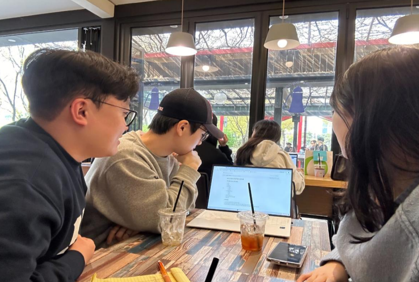
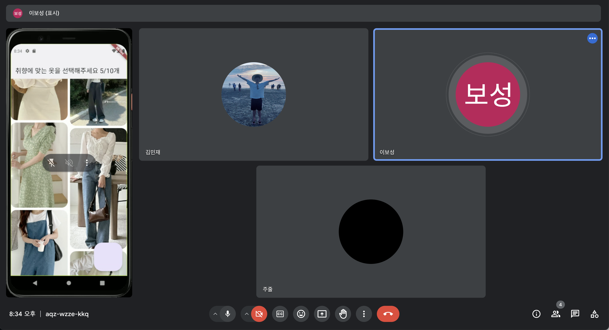
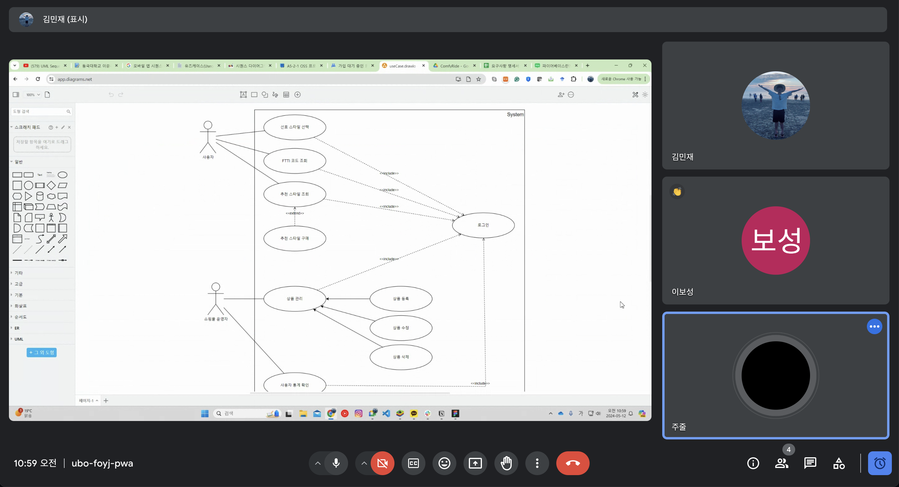

# A4.2 OSS 프로젝트 회의록

# **1차 회의(Kick-Off 미팅)**

- 일시 : 2024-03-15 15:00 ~ 17:00
- 장소 : 동국대학교 블루팟
- 참석자 : 이보성, 김민재, 장주리
- 의제 목록
  - 프로젝트 주제 및 구현 계획 수립
  - 프로젝트 정기 회의 일정 및 협업 툴 논의
  - 프로젝트 역할 분담
- 의제별 논의 요지
  - 프로젝트 주제 및 구현 계획 수립
    - 사용자가 자신의 취향에 맞는 옷을 복수개를 선택하면 해당 옷에 부여된 스타일 코드를 조합해 사용자에게 맞는 패션을 추천하는 앱을 구현한다.
    - 머신러닝을 이용하여 새로운 데이터에 라벨링을 한다.
    - 사용자가 선택할 스타일(옷)은 인터넷 쇼핑몰에서 데이터를 추출한다.
    - 앱 개발 프레임워크는 'Flutter', 데이터베이스는 'Firebase' 사용 예정이다.
    - 스타일 유형 정의에 필요한 데이터 수집을 용이하게 하기 위해 JavaScript를 사용하여 간단한 웹 인터페이스를 구현할 예정이다.
    - 머신러닝은 구글 클라우드 비전 API 사용 예정이다.
  - 프로젝트 정기 회의 일정 및 협업 툴 논의
    - 정기회의는 팀원들의 시간표를 고려하여 매주 목요일 15:00 ~ 17:00에 진행한다.
    - 프로젝트 관련 소통은 Slack을 사용하고, 협업 툴은 Notion, Github, Figma를 사용
      한다.
  - 프로젝트 역할 분담
    - 프로젝트의 주역할은 아래와 같이 분담했다.
    - 프로젝트 전체 관리 및 백엔드 : 이보성
    - 머신러닝 및 팀 레포 관리 : 김민재
    - 프론트엔트 및 회의록 작성 : 장주리
- 액션 아이템
  - 이보성 : 4월 14일까지 Flutter 프로젝트 생성 및 Firebase 연동을 진행
  - 김민재, 장주리 : 4월 13일까지 Office, Feminine, Casual 각 유형별 패션 사진을 30개 이상 수집
- 공유사항 및 차기 회의 일정
  - 차기 회의는 4월 15일 월요일 수업 종료 이후에 진행한다.
  - 회의록은 정기 회의시에만 작성한다.
  - 금일까지 모든 팀원은 프로젝트 협업 툴 Notion, Figma 초대를 수락한다.

### 회의사진

# **2차 회의**

- 일시 : 2024-04-15 19:00 ~ 21:00
- 장소 : 동국대학교 경영관 능금사랑
- 참석자 : 이보성, 김민재, 장주리
- 의제 목록
  - 머신러닝에 사용될 이미지 데이터 등록 작업
  - 추후 개발 일정 논의
- 의제별 논의 요지
  - 머신러닝에 사용될 이미지 데이터 등록 작업
    - 지난주 수집한 이미지 데이터를 Firebase에 등록한다.
    - 등록은 JavaScript로 간단하게 구현한 웹 인터페이스를 활용한다.
  - 추후 개발 일정 논의
    - 아래와 같이 개발 일정 설계 및 간트 차트 제작했다.
      ``
    - 역할 분담 : 빨간색-이보성, 초록색-김민재, 파랑색-장주리, 보라색-합동
- 액션 아이템
  - 이보성 : 2024년 4월 30일까지 추천 알고리즘 설계
  - 김민재 : 2024년 4월 30일까지 머신러닝 API 학습
  - 장주리 : 2024년 4월 30일까지 구체적인 앱 UI 설계
- 공유사항 및 차기 회의 일정
  - 차주는 시험기간인 관계로 정기 회의는 생략하고, 4월 25일 목요일 15:00에 차기
    회의를 진행한다.

# **3차 회의**

- 일시 : 2024-04-22 17:00 ~ 19:00
- 장소 : 동국대학교
- 참석자 : 이보성, 김민재, 장주리
- 의제 목록
  - FTTI 기능 구체적으로 정의
  - 프로젝트 방향성 논의
  - 쇼핑몰 연계 방향
- 의제별 논의 요지
  - FTTI 기능 구체적으로 정의
    1) 사용자 로그인
    2) 사용자가 자신의 취향에 맞는 스타일 10개 선택
    3) 사용자 취향을 바탕으로 FTTI 유형과 설명 보여줌
    4) FTTI별 스타일 보여줌
    5) 스타일 사진 선택하면 쇼핑몰로 연계 → 추가 기능
  - 프로젝트 방향성 논의
    - 이미지 데이터를 대량으로 수집해 머신러닝 기능을 극대화 시키고, 스타일 유형을 더 다양하게 하여 앱의 퀄리티를 높이자는 의견이 제시됨
    - 프로젝트에 주어진 시간, 비용 등의 측면을 고려했을 때 현실적으로 실천하기 어려울 것 같다는 판단을 함
    - 이번 프로젝트에서는 FTTI의 목표에 집중하여,  의제 1에서 정의한 기초적인 기능 구현을 목표로 진행하기로 함
    - 앱 퀄리티 및 규모 확장 등은 프로젝트 이후에 판단하여 고도화 시키기로 함
  - 쇼핑몰 연계 방향
    - 스타일 사진 선택 시 실제 쇼핑몰 사이트로 연결을 할지, 임의의 웹사이트를 구현해서 해당 사이트로 연결 될지에 대한 논의함
    - 쇼핑몰 연계 - 이미 수집한 300개 이상의 이미지 데이터의 쇼핑몰을  직접 찾아 DB에 해당 쇼핑몰 링크를 추가해야하는 번거로움이 있음
    - 임의의 쇼핑몰 구현 - 간단한 쇼핑몰 웹사이트를 구현해 현재 DB에 등록된 이미지 데이터를 등록하여 사용자가 스타일 선택시 해당 쇼핑몰로 연결되게 함.
    - 후자의 방법이 시간적, 기술적으로 효율적일 것 같아서 임의의 쇼핑몰을 직접 구현하기로 협의함
- 액션 아이템
  시험기간으로 따로 없음
- 공유사항 및 차기 회의 일정
  앞으로 정기회의는 수업시간을 활용해 진행하기로 함(매주 월,수 17:00 ~ 18:50)

# **4차 회의**

- 일시 : 2024-04-24 17:00 ~ 19:00
- 장소 : 동국대학교
- 참석자 : 이보성, 김민재, 장주리
- 의제 목록
  - BM구성에 대한 협의
  - 중간발표 준비해야할 사항
  - 앱 시현에 대한 협의
  - FTTI 유형 수 협의
  - 깃허브 merge 관련 협의
- 의제별 논의 요지
  - BM구성에 대한 협의
    - 쇼핑몰 연계까지가 가장 큰 목표인데, 현실적으로 상황이 여유치 않으니 가장 가까운 목표부터 달성해도된다. BM은 추후 확장 목표로 잡고 기능 구현하는 것을 목표로 진행 (교수님 코멘트)
    - 핵심 아이디어만 구현하고, 나머지는 추후 구현하는 대신 프로젝트 포커스를 잘 잡아야함(교수님 코멘트)
    - 교수님 코멘트를 바탕으로 이번 프로젝트에서는 현재 운영중인 쇼핑몰 링크로 연결되게 구현하고, 쇼핑몰과의 협업은 추후 기능 확장으로 계획하기로 함
  - 중간발표 준비해야할 사항
    - 유스케이스 작성(전체 프로젝트 범위 그리고 그 안에서 구현 범위 표시)
    - 대안 설정은 요구사항 분석 결과를 바탕으로 기능 범위를 지정해야 함
    - 중간 발표 전까지 설계는 완료하고, 기본 플로우는 구현 되게 하기로 함
  - 앱 시현에 대한 협의
    - 구현은 애뮬레이터나 APK파일 사용해서 시뮬레이션 보여주기로 함
  - FTTI 유형 수 협의
    - FTTI 유형은 총 7개로 정의할 예정
  - 깃허브 merge 관련 협의
    - 깃헙에 Pull Request 업로드 후 팀원 모두 확인하에 문제 없으면 Merge하기로 협의함
- 액션 아이템
  - 시험기간으로 따로 없음
- 공유사항 및 차기 회의 일정
  - 차기 회의는 다음 수업시간에 진행하기로 함

# **5차 회의**

- 일시 : 2024-04-29 17:00 ~ 19:00
- 장소 : 동국대학교 강의실
- 참석자 : 이보성, 김민재, 장주리
- 의제 목록
  - FTTI 유형 정립
  - 이미지 데이터 수집
  - 이번주 개발일정 회의 및 간트차트 수정
- 의제별 논의 요지
  - FTTI 유형 정립
    - FTTI 유형 총 14개로 정의하기로 함
    - 유형별 코드, 설명, 명칭에 대해 추후 다음 회의때 확정 짓기로 함
  - 이미지 데이터 수집
    - 취향 분석 및  추천에 사용할 이미지 데이터 수집(쇼핑몰 링크 포함)
    - O, F, C 각 10개씩 수집
  - 이번주 개발일정 회의 및 간트차트 수정
    - 이번주까지 진행할 사항 : 소셜로그인 구현, 취향 선택 페이지 구현, FTTI 유형에 대한 알고리즘 구현
- 액션 아이템
  - 이보성 : 취향 페이지 구현 (~5/4)
  - 김민재 : FTTI 유형 알고리즘 구현 (~5/4)
  - 장주리 : 소셜로그인 구현 및 이미지 데이터 수집 (~5/4)
- 공유사항 및 차기 회의 일정
  - 차기 회의는 차기 수업 시간인 수요일 수업시간에 진행하기로 함

### 회의사진

# **6차 회의**

- 일시 : 2024-05-08 19:00 ~ 21:00
- 장소 : 구글 온라인 미팅
- 참석자 : 이보성, 김민재, 장주리
- 의제 목록
  - FTTI 앱 구현 테스트
  - 중간 발표 역할분담
- 의제별 논의 요지
  - FTTI 앱 구현 테스트
    - 지금까지 구현된 사항 테스트 함. 전체적인 앱 흐름 구현은 완료 됐고, 중간발표 이후에 FTTI 유형 확정 지어서 해당 정보 바탕으로 앱 구현 완료하기로 함
    - 완료된 기능 : 로그인 기능, 스타일 선택 기능, 스타일 선택시 쇼핑몰 연계 기능
    - 보완 필요 기능 : FTTI 설명 페이지
    - 보완 필요 기능은 금일까지 마무리해서 github에 업로드 하기로 했고, 가독성 및 통일성을 위해 코드 리팩토링하기로 함
  - 중간 발표 역할분담
    - 중간발표 준비에 대한 역할 분담을 아래와 같이 진행함
    - 장주리 : PPT작성 및 앱 UI 설계서 작성, 회의록 작성
    - 이보성 : 중간보고서 작성
    - 김민재 : 유스케이스, 시스템 구성, 시퀀스도표 작성
    - 해당 역할 5/11(토) 08시까지 마무리 후 회의 진행하기로 함
- 액션 아이템
  - 이보성 : 금일까지 FTTI 설명 페이지 구현, 차기 회의까지 중간보고서 작성
  - 김민재 : 차기 회의까지  유스케이스, 시스템 구성, 시퀀스도표 작성
  - 장주리 : 금일까지 코드 리팩토링 및 차기 회의까지 PPT작성 및 앱 UI 설계서 작성
- 공유사항 및 차기 회의 일정
  - 차기 회의는 5월 11일 토요일 08시에 온라인으로 진행하기로 함

### 회의사진

# **7차 회의**

- 일시 : 2024-05-12 10:00 ~ 11:00
- 장소 : 구글 온라인 미팅
- 참석자 : 이보성, 김민재, 장주리
- 의제 목록
  - 중간보고서 리뷰
- 의제별 논의 요지
  - 중간보고서 리뷰
    - 자료 조사 결과 타 선행 사례에 비해 FTTI 앱의 사용성이 간편하고, 데이터 수는 비교적 적은 점이 있어 선행 사례 분석 내용 보완하기로 함
    - 간트차트에 개발 단위별 구현 및 테스트 일정 추가하기로 함
    - 주어진 시간과 기술적 한계로 인해 사용 경험이 있는 flutter 프레임워크와 firestore DB를 사용하는 등의 현실적 제한 요소 보완하기로 함
    - 시퀀스 다이어그램은 전체 시스템 구성도의 로그인, 스타일 추천 기능에 대해서 작성하기로 함
- 액션 아이템
  - 중간보고서 제출 자료 수정 보완
    - 이보성 : 중간보고서 수정
    - 김민재 : 시퀀스다이어그램 작성
    - 장주리 : 간트차트 수정
- 공유사항 및 차기 회의 일정
  - 5월 13일 월 중간발표

### 회의사진

# **8차 회의**

- 일시 : 2024-05-20 17:00 ~ 11:00
- 장소 : 동국대학교 강의실
- 참석자 : 이보성, 김민재, 장주리
- 의제 목록
    - 중간 발표 피드백을 바탕으로 보완할 점 논의
- 의제별 논의 요지
    - 중간 발표 피드백을 바탕으로 보완할 점 논의
        - 프로젝트 관리 파일 관련 논의
            - 이슈관리 앞으로 github로 관리하기로 함
            - 앱 프로젝트 파일 특성상 기본적으로 생성되는 파일이 많은데, 코드 수정시에 여러 코드가 수정되는 문제가 있어서 앞으로 ‘git add . → git add 파일명’ 으로 작성하기로 함
            - Github Reade me에 프로젝트 개요, 산출물 하이퍼링크로 연결되게 끔 수정하기로 함
            - Github reade me 작업 진행하기로 함(김민재)
        - 개발 관련 논의
            - 스타일 선택 페이지 카운팅 오류 해결 하기로 함(장주리)
            - 이미지 로딩 속도 개선 해결하기로 함(장주리)
            - 데이터베이스에 사용자 정보 관리 필드 추가 하기로 함(장주리)
            - FTTI 13가지 정의하기로 함(이보성)
        - 이번주까지 최대한 구현 다 마무리하고, 다음주부터 문서 작업에 집중하기로 함
- 액션 아이템
    - 중간보고서 제출 자료 수정 보완
        - 이보성 : 5/26까지 지금까지 구현한 것들 Github 이슈관리에 등록, FTTI 정의
        - 김민재 : 5/26까지 Github reade me 수정
        - 장주리 : 5/26까지 회의록 작성, 세부 구현 진행, DB 필드 추가
- 공유사항 및 차기 회의 일정
    - 차기 회의는 다음 수업 시간인 5/22에 진행 예정

# **9차 회의**

- 일시 : 2024-05-22 17:00 ~ 11:00
- 장소 : 동국대학교 강의실
- 참석자 : 이보성, 김민재, 장주리
- 의제 목록
    - 현재 진행 상황까지의 피드백 및 최종발표시 준비해야할 사항(박효순 교수님)
    - FTTI 유형 정의
    - 액션 아이템 진행 확인 및 차기 액션 아이템 수립
- 의제별 논의 요지
    - 현재 진행 상황까지의 피드백 및 최종발표시 준비해야할 사항(박효순 교수님)
        - FTTI 앱의 필요성, 경쟁력, 가치 3가치가 가장 중요한 요소이다.
        - 처음부터 돈을 벌기 위해 앱 개발에 접근하는 것이 아닌, 고객 가치 창출 위주로 접근하는 것이 좋다.
        - 기존 앱 대비 우리 앱이 가지는 경쟁력이 무엇인지 명확히 인지하고, 왜 이 앱을 개발하는지에 대해 정리하는 것이 필요하다.
        - 제안 및 중간 발표시 수립 했던 계획 대비 진척률에 대한 내용이 들어가면 좋을 것 같다.
        - 계획 대비 부진한 점이 있다면 이유와 앞으로의 계획에 대해 언급하면 좋다.
        - Firestroe DB 무료버전을 사용하고 있는 특성상 앱에 이미지 데이터를 불러오는데 시간이 많이 소요된다 → 이러한 제한 사항을 언급하면 좋다.
        - 성능 지표 및 최대 유저수에 대한 수치를 제시하는 것이 가장 좋고, 실제 상용 서비스에서는 해당 자료가 필수적으로 요구된다.
        - 최종 발표시 구현은 영상으로 준비하되, 영상 시간을 되도록 짧게 제작하면 좋을 것 같다.
    - FTTI 유형 정의
        - 사용자별 FTTI 유형 분석에 사용되는 사용자가 선택한 10개의 선호 스타일별 코드O(Office), C(Casual), F(Femine)를 바탕으로 각 유형을 어떻게 정의할지, 알고리즘은 어떻게 구현할지에 대해 논의함
        - 1안
            - 사용자가 선택한 스타일을 기준으로 10% 이하의 선택지는 무시함
            - 0 0 0 / 9 1 0 / 8 1 1 ⇒ 3, 8 2 0 / 7 3 0 / 7 2 1 / 6 3 1 ⇒ 6, 6 4 0 / 5 5 0 / 5 4 1 ⇒ 3
            5 3 2 ⇒ 6, 4 4 2 ⇒ 3, 6 2 2 ⇒ 3, 4 3 3 ⇒ 1으로 총 25개 코드가 나옴
        - 2안
            - 1안보다 더 넓은 기준으로 유형을 정의함
            - 10 0 0 / 9 1 0 / 8 1 1 / 8 2 0 / 7 2 1 / 6 2 2 ⇒ 3, 7 3 0 / 6 3 1 ⇒ 6, 6 4 0 / 5 5 0 / 5 4 1 ⇒ 3, 5 3 2 / 4 4 2 ⇒ 3, 4 3 3 ⇒ 1 으로 총 16개의 코드가 나온다
        - 큰 틀의 알고리즘은 금번 회의중 구현 했고, 세부 구현은 차기 회의시까지 완료하기로 함
    - 액션 아이템 진행 확인 및 차기 액션 아이템 수립
        - 지난주 액션 아이템 진행 확인
            - 진행완료 사항 : Github 이슈 관리 등록, FTTI 유형명 정의, 회의록 작성, 세부 구현(스타일 선택시 카운트 오류 해결, DB 필드 추가)
            - 진행 중인 사항 : Github read me 수정
        - 차기 액션 아이템 : 16가지 FTTI 유형 알고리즘 구현(장주리), FTTI 유형별 설명 및 대표 사진 수립(이보성), Github read me 수정(김민재)
- 액션 아이템
    - 이보성 : 5/27까지  FTTI 유형별 설명 및 대표 사진 수립
    - 김민재 : 5/27까지 Github reade me 수정
    - 장주리 : 5/27까지 16가지 FTTI 유형 알고리즘 세부 구현
- 공유사항 및 차기 회의 일정
    - 차기 회의는 다음 수업 시간인 5/27에 진행 예정

# **10차 회의**

- 일시 : 2024-05-27 17:00 ~ 11:00
- 장소 : 동국대학교 강의실
- 참석자 : 이보성, 김민재, 장주리
- 의제 목록
    - FTTI 유형 정의
    - 앱 시현 방법
    - 프로젝트 관리
    - 액션 아이템 진행 확인 및 차기 액션 아이템 수립
- 의제별 논의 요지
    - FTTI 유형 정의
        - FTTI 유형 16개로 확정함
        - 내일(5/28)까지 16가지 유형에 따른 설명 및 이미지 선정하여 금주까지 앱 구현 마무리 하기로 함
    - 앱 시현 방법
        - 최종 발표시 소스코드 APK 파일로 변환하여 블루스택으로 화면 시현 하기로 함
    - 프로젝트 관리
        - 지금까지 프로젝트 관리와 이슈 관리 모두 Github 이슈관리로 진행했는데, 과업관리는 Github Project 관리 이용하고, 이슈 사항만 이슈관리에 등록하기로 함
        - 지금까지 관리했던 과업에 대해 옮길 필요가 있음
    - 액션 아이템 진행 확인 및 차기 액션 아이템 수립
        - 지난주 액션 아이템 진행 확인
            - 진행 완료 사항 : Github read me 수정, FTTI 유형 알고리즘 구현
            - FTTI 유형 정의에 대한 기준이 금일 회의를 통해 확정 되었기 때문에 FTTI 유형별 설명 및 대표 이미지는 금주까지 진행하기로 함
        - 차기 액션 아이템
            - FTTI 유형 알고리즘 구현 수정 필요
            - Github read me에 실행 방법 추가 필요
            - 상세 내용은 아래 액션사항에 기재함
- 액션 아이템
  - 김민재
     - 5/29까지 github projects로 과업관리 한 것 옮기기
     - 5/29까지 README에 실행 방법 넣기
  - 이보성
     - 5/28까지 FTTI 코드 및 이미지 firestore에 upload
  - 장주리
     - 5/31까지 FTTI 저장 및 로드 로직 구현 마무리(설명 페이지, 추천페이지)

- 공유사항 및 차기 회의 일정
  - 5/29 수업시간(17:00~18:50)
  - 버그 및 테스팅 논의

# **11차 회의**

- 일시 : 2024-05-29 17:00 ~ 18:50
- 장소 : 동국대학교 강의실
- 참석자 : 이보성, 김민재, 장주리
- 의제 목록
    - 앱 버전 관리 및 배포
    - 액션 아이템 확인 및 차기 액션아이템 수립
    - 차주에 진행할 사항
- 의제별 논의 요지
    - 앱 버전관리 및 배포
        - 앱 배포및 버전을 Github Release를 통해 관리하기로 함
        - Release에 apk 파일 및 소스코드를 등록하여, 앱 업데이트시 파일 수정 업로드를 통해 버전 관리 진행하기로 함
    - 액션 아이템 진행 확인 및 차기 액션 아이템 수립
        - 지난 회의 액션 아이템 확인
            - 진행 완료 사항 : Gitub reade me 수정,  FTTI 코드 및 이미지 firestore에 upload
            - 진행 중인 사항: github projects로 과업관리, FTTI 세부 로직 구현
        - 차기 액션 아이템
            - Reade me 보완 작성
            - FTTI 대표 이미지 몇가지 수정하여 업로드
            - 진행중인 FTTI 세부 로직 구현 마무리
    - 차주에 진행할 사항
        - 금주 금요일까지 FTTI 세부 로직 구현 완료 후 Github에 올리면, 팀원 모두 pull 받아 테스트 진행
        - 수시로 버그 픽스 사항 공유하여 보완하기로 함
        - 금주까지 구현적인 것은 되도록 마무리하고, 차주부터 최종발표 관련 문서 작성에 집중하기로 함

### 액션 아이템

- 김민재
    - 6/2까지 Github Reade me 보완 작성
- 이보성
    - 6/2까지 Firestore에 FTTI 대표 이미지 수정 업로드
- 장주리
    - 5/31까지 FTTI 저장 및 로드 로직 구현 마무리

### 공유사항 및 차기 회의 일정

- 6/3 수업시간(17:00~18:50)

# **12차 회의**

- 일시 : 2024-06-03 17:00 ~ 18:50
- 장소 : 동국대학교 강의실
- 참석자 : 김민재, 장주리
- 의제 목록
    - 추가 구현 필요 사항
    - 수정 구현 필요 사항
    - 버그 사항
    - 최종 발표까지 해야할 것 정리
- 의제별 논의 요지
    - 추가 구현 필요 사항
        - 오늘 뭐입지? 페이지 구현
            - 접속시 마다 변경되는 랜덤한 스타일 추천해주는 페이지 추가
        - 메뉴바 구현
            - FTTI 재검사
            - 나의 FTTI 확인
            - 추천 스타일 확인
            - 오늘 뭐입지?
    - 수정 구현 필요 사항
        - 기존 회원은 로그인 화면 x, 바로 FTTI 설명 페이지로 이동
        - 스타일 설명페이지로 넘어갈 때 다이얼로그를 페이지로 구현
            - 해당 화면 약 2초 뒤에 자동으로 꺼지도록 구현
        - FTTI 설명 페이지에 뒤로가기 버튼 없애기
    - 버그 사항
        - FTTI 설명 페이지 중복 생성 방지 (쇼다이얼로그→페이지로 구현하면 해당 버그 안생길수도?)
    - 최종발표 전까지 해야할 것
        - reade me 수정
        - 최종 보고서 작성
            - 다이어그램 수정
            - 요구사항 명세서 수정
            - 화면 설계서 수정
            - DB 문서 수정
            - 플로차트 수정
        - 발표자료 작성
        - 시연 영상 촬영
    - 액션 아이템 진행 확인 및 차기 액션 아이템 수립
        - 지난 회의 액션 아이템 확인
            - 진행 완료 사항 : Reade me 보완, FTTI 세부 로직 구현
        - 차기 액션 아이템
            - 액션 아이템에 기재

### 액션 아이템

- 김민재
    - 6/5 reade me 수정, 최종보고서 수정
- 장주리
    - 6/4까지 추가 구현 및 수정 구현
    - 

### 공유사항 및 차기 회의 일정

- 6/3 수업시간(17:00~18:50)

# **13차 회의**

- 일시 : 2024-06-05 17:00 ~ 18:50
- 장소 : 동국대학교 강의실
- 참석자 : 이보성, 김민재, 장주리
- 의제 목록
    - 구현 사항 정리
    - 수정 구현 필요 사항
    - 버그 사항
    - 최종발표 준비 역할 분담
    - 액션 아이템 진행 확인 및 차기 액션 아이템 수립
- 의제별 논의 요지
    - 구현 사항 정리
        - 계획 했던 구현 사항은 모두 완료 함
        - 랜덤 스타일 추천 페이지 구현 완료됨
    - 수정 구현 필요 사항
        - 좋아요 기능 구현 하기에는 시간이 부족하므로, 찜 기능 추가하기로 함
    - 버그 사항
        - 최초 로그인시 에러
        - Cozy Elegance FTTI 이미지 안뜸
    - 최종발표 준비 역할 분담
        - 김민재 : 최종보고서 초안 작성, Github reade me, 다이어그램 등 작성
        - 이보성 : 최종 발표 자료(PPT) 초안 작성, 찜 기능 구현, 앱 스플래쉬 화면 구현
        - 장주리 : 버그 픽스, 앱 로딩시 로그인 여부 확인하는 로직 구현, 요구사항 명세서, 화면 설계서 등 문서 수정
    - 액션 아이템 진행 확인 및 차기 액션 아이템 수립
        - 지난 회의 액션 아이템 확인
            - 진행 완료 사항 : Reade me 보완, 랜덤 스타일 추천 페이지 구현
        - 차기 액션 아이템
            - 액션 아이템에 기재

### 액션 아이템

- 김민재
    - 6/6 23:39까지 최종보고서 초안 작성
- 이보성
    - 6/6까지 찜 기능 구현
    - 6/7 12시까지 최종발표자료 초안 작성
- 장주리
    - 6/7까지 버그 픽스 및 로그인 여부 검사 기능 구현, 각종 설계서 작성

### 공유사항 및 차기 회의 일정

- 6/7 12시 구글 미팅 진행하기로 함
- 최종 발표 준비사항 확인

    
# **14차 회의**

- 일시 : 2024-06-07 12:00 ~ 13:00, 16:00~17:00
- 장소 : 구글 온라인 미팅
- 참석자 : 이보성, 김민재, 장주리
- 의제 목록
    - 구현 사항 정리
    - 앱 배포 관련 논의
    - 최종발표 준비
    - 액션 아이템 진행 확인 및 차기 액션 아이템 수립
- 의제별 논의 요지
    - 구현 사항 정리
        - 찜 기능 및 로그아웃 기능 구현 완료
    - 앱 배포
        - 버그 픽스 되는대로 원스토어에 앱 등록해보기로 함
    - 최종 발표 준비
        - 최종보고서 초안을 바탕으로 필요한 부분 역할 분담하여 각 서류 작성하기로 함
        - 김민재 : 시퀀스다이어그램, 유스케이스, 시스템구성도
        - 이보성 : 최종발표 자료 (ppt) 준비
        - 장주리 : 화면 설계, DB 구성, Flow Chart, 요구사항 명세서, 간트 차트 작성

### 액션 아이템

- 김민재
    - 금일(6/7)까지 시퀀스 다이어그램, 유스케이스, 시스템 구성도 작성
- 이보성
    - 6/8까지 최종 발표 자료 작성
- 장주리
    - 금일(6/7) 화면 설계, DB 구성, Flow Chart, 요구사항 명세서, 간트 차트 작성

### 공유사항 및 차기 회의 일정

- 시험 기간 및 최종 발표 준비 기간이 겹치기 때문에 소통 필요할 때마다 수시로 회의 진행하기로 함
[👉***README로 돌아가기***](https://github.com/CSID-DGU/2024-1-OSSProj-ComfyRide-01)
