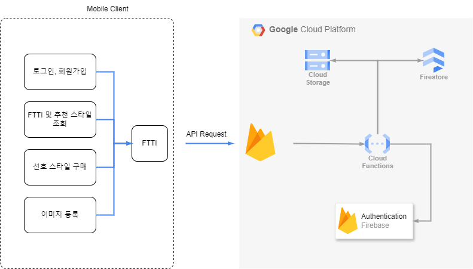

# FTTI

## Team&Members

### 팀명: 버스태워조

  | 역할 |  성명  |
  | :---: | :---: |
  | FE | **이보성** |
  | BE | **장주리** |
  | ML&PM | **김민재** |

## 앱 실행 화면

(앱 실행화면 사진 넣기)

## 프로젝트 소개

- 모바일 앱을 통해 사람들에게 선호 스타일을 통해 패션 코드(FTTI)를 부여합니다.
- FTTI를 바탕으로 옷 스타일에 대한 큐레이션과 추천을 해줍니다.

## 개발 환경

- OS: MacOS, Windows
- Code Editor: VS Code, Android Studio
- Collaboration Tool: Notion, Github, Slack, Figma, Google Drive

## Tech Stack

## 시스템 구성도

- 시스템 구성도에 대한 설명
  

## 기대효과

1. 사람들의 패션 증진
2. (추가 기대효과 작성 예정)

## 프로젝트 산출물

[👉수행계획서](Doc/1_1_OSSProj_01_버스태워조_수행계획서.md)
[👉수행계획 발표자료](Doc/1_2_OSSProj_01_버스태워조_수행계획발표자료%20.pdf)
[👉중간보고서](Doc/2_1_OSSProj_01_버스태워조_중간보고서.md)
[👉중간발표자료](Doc/2_2_OSSProj_01_버스태워조_중간발표자료.pdf)
[👉최종보고서](Doc/3_1_OSSProj_Tn_Tname_최종보고서.md)
[👉최종발표자료](Doc/)
[👉회의록](Doc/4_2_OSSProj_1_버스태워조_회의록.md)

## 라이선스

이 프로젝트는 MIT 라이선스에 따라 라이선스가 부여됩니다. 자세한 내용은 [LICENSE](LICENSE) 파일을 참조하세요.