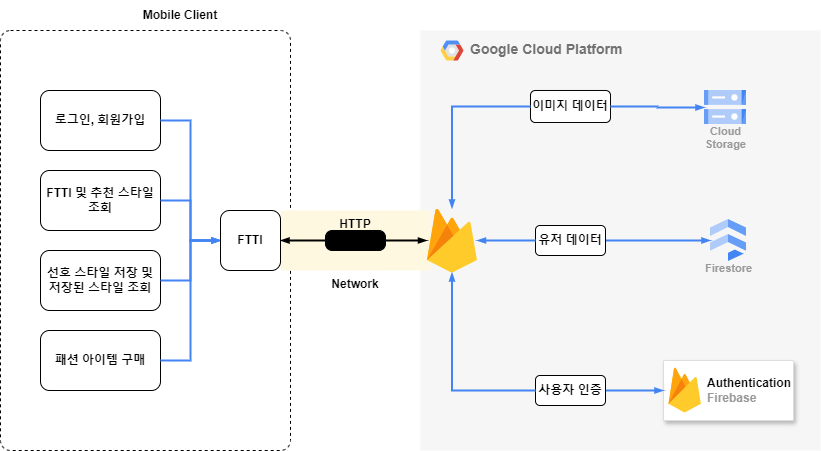

# FTTI(Fashion Tendency Types Indicator)

## Team&Members

> 팀명: 버스태워조

  | 역할 |  성명  |
  | :---: | :---: |
  | FE&팀장 | **이보성** |
  | BE | **장주리** |
  | ML&PM | **김민재** |

## 프로젝트 소개

> 모바일 앱을 통해 사람들에게 선호 스타일을 통해 패션 코드(FTTI)를 부여합니다.  
> FTTI를 바탕으로 옷 스타일에 대한 큐레이션과 추천을 해줍니다.

## 구현결과

### 1. 로그인 화면  

  

### 2. 스타일 선택 화면  

 

### 3. FTTI 조회 화면  

### 4. 스타일추천 화면  

### 4.1. 찜&찜목록 화면

 

### 5. 랜덤 스타일 추천 화면  

### 6. 아이템 구매 화면

## 개발 환경

### OS

### Code Editor

### Collaboration Tool

## Tech Stack

### FE

### ML

### BE(Server&DB)

## 시스템 구성도

- 시스템 구성도에 대한 설명
  

## 기대효과

1. **개인화된 패션 추천 :** 사용자의 패션 관심사와 취향을 고려하여 개인화된 패션 추천을 제공함으로써, 사용자들이 자신에게 맞는 스타일을 더욱 쉽게 발견할 수 있습니다.
2. **패션 트렌드 이해 증진 :** 앱을 통해 사용자들은 자신의 패션 트렌드 유형을 더 잘 이해하고 인식할 수 있습니다. 이는 사용자들이 더 나은 패션 선택을 할 수 있도록 돕고, 새로운 트렌드를 발견하는 데 도움이 됩니다.
3. **고객 만족도 향상 :** 개인화된 추천 시스템을 통해 사용자들은 자신의 취향에 맞는 제품을 더 쉽게 찾을 수 있습니다. 이는 사용자들의 만족도를 높이고 앱을 계속 이용하도록 유도할 수 있습니다.
4. **맞춤형 광고 및 마케팅 가능성 :** 개인화된 패션 추천을 통해 사용자의 취향과 관심사를 더 잘 이해할 수 있습니다. 이는 패션 브랜드 및 이커머스 플랫폼에게 맞춤형 광고 및 마케팅 기회를 제공하고, 광고 효율성을 높일 수 있습니다.

## 프로젝트 산출물

| 분류 |  산출물  |
| :---: | :---: |
| 수행 | [수행계획서](Doc/1_1_OSSProj_01_버스태워조_수행계획서.md)🔹[수행계획 발표자료](Doc/1_2_OSSProj_01_버스태워조_수행계획발표자료%20.pdf) |
| 중간 | [중간보고서](Doc/2_1_OSSProj_01_버스태워조_중간보고서.md)🔹[중간발표자료](Doc/2_2_OSSProj_01_버스태워조_중간발표자료.pdf)|
| 최종 | [최종보고서](Doc/3_1_OSSProj_01_버스태워조_최종보고서.md)🔹[최종발표자료](Doc/)|
| 기타 | [제품구성&배포운영자료](Doc/4_3_OSSProj_01_버스태워조_제품구성배포운영자료.md)🔹[Overview](Doc/4_4_OSSProj_01_버스태워조_Overivew.md)🔹[범위&일정&이슈관리](Doc/4_1_OSSProj_01_버스태워조_범위_일정_이슈관리.md)🔹[회의록](Doc/4_2_OSSProj_1_버스태워조_회의록.md) |

## 라이선스

이 프로젝트는 MIT 라이선스에 따라 라이선스가 부여됩니다. 자세한 내용은 [LICENSE](LICENSE) 파일을 참조하세요.
